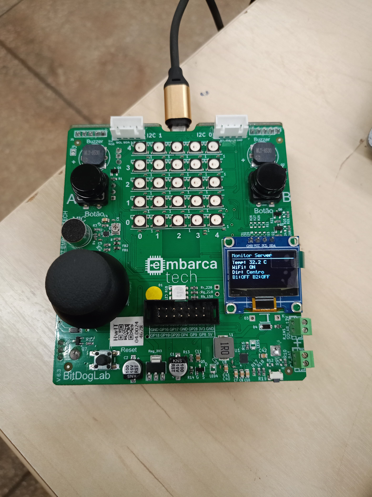
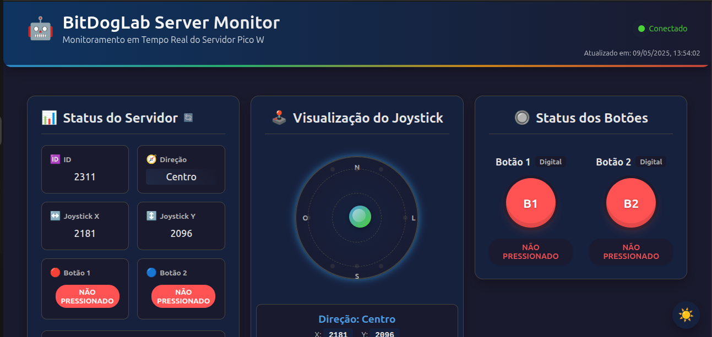

# BitDogLab Server Monitor

## Descrição

O **BitDogLab Server Monitor** é um projeto IoT que utiliza o BitDogLab para monitorar botões, joystick e sensores. Ele coleta dados de hardware e os envia para um servidor local ou na nuvem, permitindo o monitoramento em tempo real e a interação através de um painel de controle.

## Estrutura do Projeto

O projeto é dividido em três componentes principais:

### 1. API Backend
- **Tecnologia**: Django
- **Descrição**: Fornece endpoints REST para gerenciar e armazenar os dados coletados.
- **Localização**: Diretório `api/`

### 2. Dashboard Frontend
- **Tecnologia**: React
- **Descrição**: Interface gráfica para exibir os dados em tempo real e interagir com o sistema.
- **Localização**: Diretório `dashboard/`

### 3. Monitor Server
- **Tecnologia**: C para Raspberry Pi Pico
- **Descrição**: Componente embarcado que coleta dados de hardware e os envia para o backend.
- **Localização**: Diretório `monitorSever/`

## Pré-requisitos

- Docker e Docker Compose
- Node.js e npm (para desenvolvimento do frontend)
- Python 3.9+ e pip (para desenvolvimento do backend)
- Raspberry Pi Pico SDK (para o componente embarcado)

## Como Executar

### 1. Configuração do Ambiente

Crie um arquivo `.env` na raiz do projeto com as seguintes variáveis:

```env
# Django API Settings
SECRET_KEY='sua_chave_secreta_aqui'
DEBUG=True
ALLOWED_HOSTS=localhost,127.0.0.1
DATABASE_ENGINE=django.db.backends.sqlite3
DATABASE_NAME=db.sqlite3
API_HOST=localhost
API_PORT=8001

# React Dashboard Settings
REACT_APP_API_URL=http://localhost:8001
```

### 2. Subindo os Serviços com Docker

Na raiz do projeto, execute:

```bash
docker-compose up --build
```

### 3. Acessando o Sistema

- **API Backend**: [http://localhost:8001](http://localhost:8001)
- **Dashboard Frontend**: [http://localhost:3000](http://localhost:3000)

### Executando Sem Docker Compose

Caso prefira rodar o projeto sem utilizar o Docker Compose, siga os passos abaixo:

#### 1. Configurando o Backend (API)

1. Certifique-se de ter o Python 3.9+ instalado.
2. Crie um ambiente virtual para o projeto:
   ```bash
   python -m venv venv
   ```
3. Ative o ambiente virtual:
   - **Linux/macOS**:
     ```bash
     source venv/bin/activate
     ```
   - **Windows**:
     ```bash
     venv\Scripts\activate
     ```
4. Navegue até o diretório `api/`:
   ```bash
   cd api
   ```
5. Instale as dependências do projeto:
   ```bash
   pip install -r requirements.txt
   ```
6. Realize as migrações do banco de dados:
   ```bash
   python manage.py migrate
   ```
7. Inicie o servidor de desenvolvimento:
   ```bash
   python manage.py runserver
   ```

#### 2. Configurando o Frontend (Dashboard)

1. Certifique-se de ter o Node.js e o npm instalados.
2. Navegue até o diretório `dashboard/`:
   ```bash
   cd dashboard
   ```
3. Instale as dependências do projeto:
   ```bash
   npm install
   ```
4. Inicie o servidor de desenvolvimento:
   ```bash
   npm start
   ```

#### 3. Configurando o Monitor Server

1. Certifique-se de ter o SDK do Raspberry Pi Pico configurado no seu ambiente.
2. Navegue até o diretório `monitorSever/`:
   ```bash
   cd monitorSever
   ```
3. Compile o código:
   ```bash
   mkdir -p build && cd build
   cmake ..
   make
   ```
4. Envie o arquivo gerado (`monitorSever.uf2`) para o Raspberry Pi Pico.

Após seguir esses passos, o sistema estará rodando sem a necessidade de Docker Compose.

## Configuração de IP e Senha

### Verificando o IP da Máquina
Para que o sistema funcione corretamente, é necessário configurar o IP da máquina onde o servidor está rodando. Siga os passos abaixo para verificar o IP:

- **Linux**: Execute o comando `ifconfig` no terminal e procure pelo endereço IP associado à interface de rede.
- **Windows**: Execute o comando `ipconfig` no Prompt de Comando e procure pelo endereço IP associado à interface de rede.

Certifique-se de que o IP configurado seja acessível pela rede e que a porta utilizada (padrão: 4444) não esteja bloqueada por firewall.

### Alterando a Senha
Para alterar a senha de acesso ao sistema, edite o arquivo `.env` e modifique a variável `SECRET_KEY` para uma nova chave secreta. Certifique-se de que a nova chave seja forte e única.

## Configuração de Rede no Monitor Server

No arquivo `monitorSever/monitorSever.c`, você encontrará as seguintes definições de configuração de rede:

```c
#define SSID_WIFI "Embarca"
#define SENHA_WIFI "EmbarcaTech01"

#define SERVIDOR_IP_0 10
#define SERVIDOR_IP_1 8
#define SERVIDOR_IP_2 45
#define SERVIDOR_IP_3 122
```

### Como Alterar

- **SSID_WIFI**: Substitua "Embarca" pelo nome da sua rede Wi-Fi.
- **SENHA_WIFI**: Substitua "EmbarcaTech01" pela senha da sua rede Wi-Fi.
- **SERVIDOR_IP_0 a SERVIDOR_IP_3**: Configure o endereço IP do servidor receptor, dividindo-o em quatro partes. Por exemplo, para o IP `192.168.1.100`, configure:
  ```c
  #define SERVIDOR_IP_0 192
  #define SERVIDOR_IP_1 168
  #define SERVIDOR_IP_2 1
  #define SERVIDOR_IP_3 100
  ```

Certifique-se de salvar as alterações e recompilar o código para que as novas configurações entrem em vigor.

## Imagens do Sistema

### Visão Geral


### Tela 1


## Licença

Este projeto é licenciado sob a licença MIT. Veja o arquivo [LICENSE](LICENSE) para mais detalhes.

## Contatos

Para mais informações ou dúvidas sobre o projeto, entre em contato:

- **Email**: heitorlouzeirodev@gmail.com
- **Linkedin**: [https://www.linkedin.com/in/heitor-louzeiro/](https://www.linkedin.com/in/heitor-louzeiro/)
- **GitHub**: [https://github.com/HeitorLouzeiro](https://github.com/HeitorLouzeiro)
